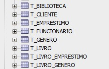

# 📚 CP2 - Sistema de Biblioteca (Clean Architecture + EF Core + Oracle)

## 👥 Integrantes do Grupo
* **Enzo Vaz** - RM: 561702
* **Lucas Ryuji Fukuda** - RM: 562152
* **Pietro Donella Salomão** - RM: 561722

## 🧭 Domínio do Projeto
O projeto consiste em um **Sistema de Gestão de Biblioteca** desenvolvido com foco em escalabilidade e manutenibilidade. O objetivo principal é gerenciar o acervo físico de livros, categorias, funcionários e o fluxo de empréstimos para clientes.

## 🛠️ Tecnologias e Persistência
Nesta etapa (CP2), implementamos a persistência de dados real utilizando:
* **SGBD:** Oracle SQL
* **ORM:** Entity Framework Core
* **Mapeamento:** Fluent API para garantir total controle sobre o esquema do banco, mapeando chaves, restrições e relacionamentos (1:N e N:N).
* **Versionamento:** Migrations para controle de evolução do banco de dados.

## 🧱 Estrutura do Projeto (Clean Architecture)
A solução foi organizada seguindo os princípios da **Clean Architecture** e **DDD**, com separação clara de responsabilidades:

* **`Biblioteca.Domain`**: Contém as Entidades ricas e regras de negócio puras (sem dependências externas).
* **`Biblioteca.Application`**: Define as interfaces de repositório (`IRepository`) e os contratos do sistema.
* **`Biblioteca.Infrastructure`**: Responsável pela implementação da persistência.
  * `/Persistence`: Contém o `BibliotecaContext` e a implementação do **Repositório Genérico**.
  * `/Persistence/Configurations`: Mapeamentos explícitos via Fluent API para cada entidade.
  * `/Migrations`: Histórico de versionamento estrutural do banco de dados.
* **`Biblioteca.API`**: Camada de entrada, onde é feita a configuração de Injeção de Dependência (IoC) e a exposição dos endpoints.

## 🗄️ Validação do Cenário (Esquema Físico)
O banco de dados foi gerado com sucesso no Oracle SGBD. Abaixo, a evidência do esquema físico validando a criação das tabelas e das associativas geradas pelo EF Core:



## 🚀 Como executar o projeto localmente
1. Configure a sua string de conexão no arquivo `appsettings.json` (projeto `Biblioteca.API`) substituindo as credenciais temporárias pelas suas locais. 
   > ⚠️ **Nota de Segurança:** As credenciais reais foram omitidas deste repositório para evitar o vazamento de dados sensíveis.
2. Abra o terminal na pasta do projeto `Biblioteca.API`.
3. Execute o comando abaixo para aplicar as migrations e gerar as tabelas no seu banco local:
   ```bash
   dotnet ef database update --project ../Biblioteca.Infrastructure --startup-project .
   ```
