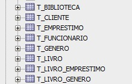

# 📚 CP3 - Sistema de Biblioteca (Clean Architecture + EF Core + API REST)

## 👥 Integrantes do Grupo
* **Enzo Vaz** — RM: 561702
* **Lucas Ryuji Fukuda** — RM: 562152
* **Pietro Donella Salomão** — RM: 561722

## 🧭 Domínio do Projeto
O projeto consiste em um **Sistema de Gestão de Biblioteca** desenvolvido com foco em escalabilidade e manutenibilidade. O objetivo principal é gerenciar o acervo físico de livros, categorias (gêneros), funcionários e o fluxo de empréstimos para clientes.

## 🛠️ Tecnologias e Persistência
* **SGBD:** Oracle SQL (herdado do CP2)
* **ORM:** Entity Framework Core
* **Mapeamento:** Fluent API (chaves, restrições e relacionamentos 1:N e N:N)
* **Versionamento:** Migrations
* **API:** ASP.NET Core (`net10.0`) com Swagger/OpenAPI e tratamento global de erros (RFC 7807)

## 🧱 Estrutura do Projeto (Clean Architecture)
A solução foi organizada seguindo os princípios da **Clean Architecture** e **DDD**, com separação clara de responsabilidades:

* **`Biblioteca.Domain`**: entidades ricas, regras de negócio e exceções de domínio (`DomainException`, `ResourceNotFoundException`, `ConflictException`).
* **`Biblioteca.Application`**: contratos (`IRepository<T>`), DTOs de request/response. A API **não** expõe entidades de domínio.
* **`Biblioteca.Infrastructure`**: persistência.
  * `/Persistence`: `BibliotecaContext` e implementação do **repositório genérico** (`Repository<T>`).
  * `/Persistence/Configurations`: mapeamentos Fluent API.
  * `/Migrations`: histórico estrutural do banco (CP2, intacto).
* **`Biblioteca.API`**: composição (DI), controllers HTTP, Swagger e `GlobalExceptionHandler`. **Não** injeta `DbContext` nos controllers.

## 🗄️ Validação do Cenário (Esquema Físico — CP2)
O banco de dados foi gerado com sucesso no Oracle SGBD. Abaixo, a evidência do esquema físico validando a criação das tabelas e das associativas geradas pelo EF Core:



## 🚀 Como executar a API e abrir o Swagger
1. Configure a string de conexão no arquivo `appsettings.json` (projeto `Biblioteca.API`) substituindo as credenciais temporárias pelas suas locais.
   > ⚠️ **Nota de Segurança:** as credenciais reais foram omitidas deste repositório para evitar o vazamento de dados sensíveis.
2. Abra o terminal na pasta do projeto `Biblioteca.API`:
   ```bash
   cd src/Biblioteca/Biblioteca.API
   ```
3. Aplique as migrations (CP2) no Oracle local:
   ```bash
   dotnet ef database update --project ../Biblioteca.Infrastructure --startup-project .
   ```
4. Suba a API:
   ```bash
   dotnet run
   ```
5. Abra o **Swagger UI**:
   * HTTP: [http://localhost:5267/swagger](http://localhost:5267/swagger)
   * HTTPS: [https://localhost:7095/swagger](https://localhost:7095/swagger)
   * Documento OpenAPI: `/swagger/v1/swagger.json`

## 🌐 Recursos HTTP (CP3)
| Recurso | Rotas | Operações |
|---------|--------|-----------|
| Gêneros | `/api/generos` | GET lista, GET por id, POST, PUT, DELETE |
| Bibliotecas | `/api/bibliotecas` | GET lista, GET por id, POST |
| Livros | `/api/livros` | GET lista, GET por id, POST |
| Clientes | `/api/clientes` | GET lista, GET por id, POST |

Os controllers usam DTOs, chamam `IRepository<T>` e devolvem `Ok` / `Created` / `NoContent`. Regras de negócio continuam nas entidades; id inexistente lança `ResourceNotFoundException` (404 via handler).

### Exemplos de chamada
Criar um gênero:
```bash
curl -X POST http://localhost:5267/api/generos ^
  -H "Content-Type: application/json" ^
  -d "{\"nome\":\"Fantasia\",\"descricao\":\"Narrativas com elementos magicos e mundos imaginarios.\"}"
```

Listar gêneros:
```bash
curl http://localhost:5267/api/generos
```

Buscar um id inexistente (espera **404** em `application/problem+json`):
```bash
curl -i http://localhost:5267/api/generos/00000000-0000-0000-0000-000000000001
```

Payload inválido (descrição curta) espera **400**:
```bash
curl -X POST http://localhost:5267/api/generos ^
  -H "Content-Type: application/json" ^
  -d "{\"nome\":\"X\",\"descricao\":\"curta\"}"
```

Há também exemplos em `src/Biblioteca/Biblioteca.API/Biblioteca.http`.

## 📦 Repositório genérico
Contrato `IRepository<T>` (Application), com `T : BaseEntity`:

* `GetAllAsync` / `GetByIdAsync` — leituras com `AsNoTracking`
* `AddAsync` / `UpdateAsync` / `DeleteAsync`
* `ExistsByIdAsync`

Implementação `Repository<T>` (Infrastructure) usa `DbContext.Set<T>()` e resolve a chave primária pelo modelo do EF (cada agregado tem PK própria: `IdGenero`, `IdLivro`, etc.).

Registro na DI (`Biblioteca.Infrastructure.DependencyInjection`):
```csharp
services.AddScoped(typeof(IRepository<>), typeof(Repository<>));
```

Uso demonstrado de ponta a ponta no CRUD de **Gênero** e também em bibliotecas, livros e clientes (incluindo `ExistsByIdAsync` para validar a biblioteca pai).

## ⚠️ Mapeamento de exceções (`GlobalExceptionHandler`)
Handler na API implementando `IExceptionHandler`, registrado com `AddExceptionHandler`, `AddProblemDetails` e `UseExceptionHandler()` **antes** de Swagger e `MapControllers`. Respostas no padrão **RFC 7807** (`ProblemDetails`, `application/problem+json`). Stack trace e detalhes de banco **não** são devolvidos fora de Development.

| Exceção | Status HTTP | Título típico |
|---------|-------------|---------------|
| `ArgumentException` | **400** | Requisição inválida |
| `DomainException` (regra de negócio) | **400** | Regra de negócio violada |
| `ResourceNotFoundException` / `KeyNotFoundException` | **404** | Recurso não encontrado |
| `ConflictException` | **409** | Conflito (ex.: nome de gênero ou e-mail duplicado) |
| Demais exceções | **500** | Erro interno (mensagem genérica fora de Development) |

Exemplo anonimizado de 404: [`docs/problem-details-404.json`](./docs/problem-details-404.json).
Exemplo anonimizado de 400: [`docs/problem-details-400.json`](./docs/problem-details-400.json).
Print do Swagger UI com os endpoints documentados: [`docs/swagger-ui.png`](./docs/swagger-ui.png).
